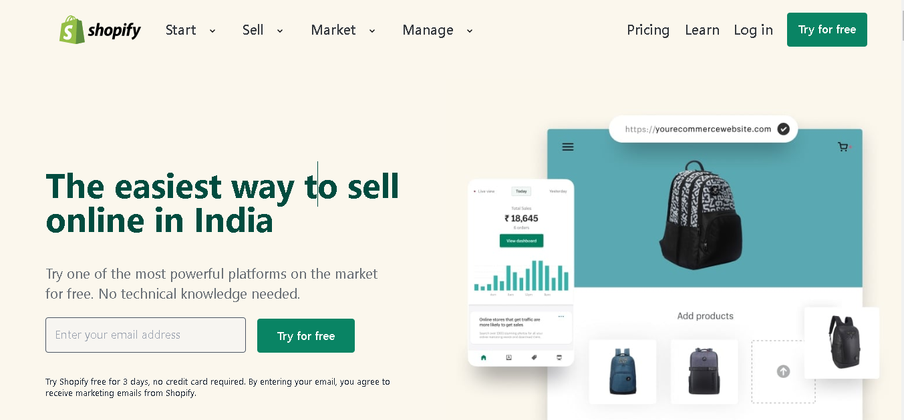

# shopify_ui_clone

# Project [Deployed Link](https://deepakshopifyuiclone.netlify.app/)

- What did I learn from this Project?
  -
  - Learned how to make fully responsive website using TailwindCSS.
  - Learned how to make a full fledged website end to end.
  - Learned how to manage videos and arrange them.
  - Created fixed position navbar.
  - Created different section based on the screen size.
  - created complex footer.
  -Used daisyUI **(daisyUI is a customizable Tailwind CSS component library that prevents verbose markup in frontend applications.)**.

---

## Time taken to finish this project

- it took me 2.5 days to complete it.

---

## ScreenShot

